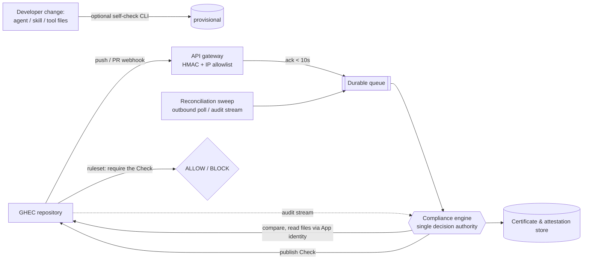

# AI Agent Governance for GitHub Enterprise Cloud — Design & Flow

> A governance system that detects, classifies, risk-scans, certifies, and gates
> AI-agent code committed to repositories in GitHub Enterprise Cloud (GHEC).
> This document describes the design, assumptions, and end-to-end flow. It is
> accompanied by a proof-of-concept scanner (`gov-scan`).

---

## 1. Purpose

Teams increasingly commit **AI-agent code** — agents built with coding assistants, agent frameworks (LangChain, CrewAI, AutoGen, Semantic Kernel…), MCP servers, tool definitions, and prompt/skill files. This system gives a governance team a way to:

- **Detect** when a change introduces or modifies agent-related code,
- **Assess** the agent's capabilities and blast radius (does it run shells, reach the network, read secrets?),
- **Certify** each piece of content against a versioned policy, and
- **Gate** merges into protected branches when an agent is deemed unsafe.

## 2. Goals and non-goals

**Goals**
- Scan on push/PR and decide agentic vs non-agentic, then risk-rank agentic code.
- Make the decision the **required status check** that gates a merge.
- Scale to many repositories and a high push rate without re-scanning the world.
- Produce machine-readable reports the governance team can review and share.

**Non-goals (v1)**
- Governing agents that **run on** the platform (coding agents, cloud agents). Those are covered by the platform's native enterprise AI controls and audit log; this system governs **agent code in repositories**.
- Replacing existing CI/build, secret scanning, or SAST — it complements them.

## 3. Assumptions and constraints

1. **GitHub Enterprise Cloud (GHEC)**, not self-hosted Server. Consequence: **no pre-receive hooks**, so push-time enforcement is done with **repository rulesets requiring a status check**, not a server-side block.
2. The **governance application runs in the enterprise's own cloud**, network-separated from GHEC.
3. **Inbound to a single hardened endpoint is permitted** (an API gateway restricted to the platform's webhook IP ranges, verifying HMAC signatures). No broad inbound exposure.
4. Source lives in GHEC; existing build pipelines run in a **separate CI system** — governance must not depend on that pipeline running.
5. Webhook delivery is **best-effort**, so a **reconciliation sweep** is required for completeness.
6. The reference workstream in scope for this document is **Rules + Certification**.

## 4. Two problems, kept separate

| | (A) Agents that **run on** the platform | (B) Agent **code committed** to repos |
|---|---|---|
| Examples | cloud coding agents, code-review agents, custom agents | committed framework code, MCP servers, tool defs, skill/prompt files |
| Governed by | the platform's **native enterprise AI controls + agent audit log** | **this system** |
| Our effort | *configure* policy, *consume* audit events | *detect → deep-scan → fingerprint → certify → gate* |

This document addresses **(B)**.

## 5. End-to-end flow



**Control points**

1. **Developer change** — agent, skill, hook, or other files created locally.
2. **Self-verification (optional)** — a local CLI gives a *provisional* result before push.
3. **Push event** — a webhook fires with `before`/`after` **commit SHAs**.
4. **Gateway ingress** — the API gateway verifies the HMAC signature, acknowledges within the delivery timeout, and enqueues.
5. **Durable queue** — absorbs bursts; the engine consumes asynchronously.
6. **Compliance engine (single decision authority)** — resolves the delta, classifies each changed file, certifies, and decides.
7. **PR / merge verification** — verifies the head commit is certified; no duplicate certification.
8. **Ruleset enforcement** — a repository ruleset requires the engine's status **Check**; ALLOW or BLOCK.
9. **Pass / warn vs. blocked** — verdict maps to the Check conclusion.
10. **Final-state validation** — a protected-branch monitor detects bypass or drift (force-push, admin override), fed by the audit stream.

## 6. Detection engine

### 6.1 Acquiring the file set
- **Delta mode (steady state):** on a push, call the **Compare API** `compare(last_certified_sha … head)`; it returns only the **changed files**, each with its **blob SHA**.
- **First-push / reconciliation mode:** walk the full tree (commit → tree → blobs).

### 6.2 Content addressing (the core trick)
Each file's **blob SHA is a content hash** supplied by the platform. Certifying **by blob SHA** yields three properties for free:
- **Cache / inherit** — content already certified is never re-scanned.
- **Delta-only scanning** — only changed files have new SHAs, so only they are examined.
- **Global dedup** — identical content across repositories is certified once.

### 6.3 Two-tier scanning
- **Stage A — triage (cheap):** decide *agentic vs non-agentic* from **name/path** and, for dependency **manifests**, a token scan. Most files are decided with **no content download**.
- **Stage B — deep scan (only agentic candidates):** build a **capability profile**. For Python, the code is parsed into an **AST** (format-independent, so whitespace/rename tricks don't evade it); other languages fall back to pattern signals. Capabilities detected include *shell execution, network egress, secret access, tool definitions, and high autonomy*.

### 6.4 Verdict rules
A capability profile maps to a verdict via a small, reviewable rule set:
- shell **and** egress **and** secrets → **blocked** (exfiltration risk);
- shell **and** egress → **blocked**;
- any one of shell / egress / secrets → **certified-with-warnings**;
- otherwise → **certified**.

## 7. Certification model

### 7.1 Per-file certificate (keyed by blob SHA)
```
{ blob_sha, path, classification, verdict, reason,
  capabilities[], policy_version, issued_by }
```

### 7.2 Controlled re-certification (policy versioning)
Every certificate records the **policy version** under which it was issued. A certificate is valid only when **content matches AND policy version matches**. When the rules change, the version is bumped; stale certificates are re-scanned **once** on the next pass and re-issued, then inheritance resumes. This makes a rule change **propagate to exactly what it affects**, without rescanning everything.

### 7.3 Agent-level fingerprints
An agent is usually several files. Files are grouped into an agent, which gets two identities:
- **CONTENT_FP** — hash of the sorted `path:blob_sha` set; **changes on any byte change** ("is this the exact same agent?").
- **CAP_FP** — hash of the union of capabilities; **stable across cosmetic edits** ("is this materially the same agent?").
An agent's verdict is the **worst** among its files. Together the two fingerprints separate *"changed but harmless"* from *"changed and now more dangerous."*

### 7.4 Lifecycle
Issue → inherit → expire → revoke. A known **CONTENT_FP** need not be re-certified ("no duplicate certification").

## 8. Enforcement

Because GHEC has no pre-receive hooks, the gate is a **repository ruleset** that **requires a status check**. The engine publishes a **Check Run** (via its App identity) on the head commit; the ruleset allows or blocks the merge on that check. Enforcement lives in the platform and is **independent of the separate CI pipeline**, so skipping CI cannot skip governance.

## 9. Eventing and egress-safe ingestion

Two ingest paths, on purpose:
1. **Repository webhooks → gateway** (fast path for code events). Inbound but hardened: HMAC verification + platform webhook IP allowlist; acknowledge fast, process async off the queue.
2. **Reconciliation / audit path** (completeness). Because webhooks are best-effort, an outbound **poll** and/or an **audit-log stream to the enterprise cloud** catches missed deliveries and carries **agent-runtime and bypass events** that never arrive as repository webhooks.

## 10. Scale and performance

- **Rate limits:** prefer an **App installation token**; use conditional requests; where possible run the scan **inside a platform Action** (code already checked out → zero content fetches).
- **Volume control:** delta-only scanning, the blob-SHA cache, Stage-A filtering, and **gating at PR time** (not every feature-branch commit) keep cost proportional to *changed agentic content*, not files touched.
- **State:** the certificate store becomes a real key-value database keyed by blob SHA; engine workers scale horizontally off the queue.

## 11. Proof of concept (`gov-scan`)

A dependency-free reference implementation that mirrors the loop end-to-end:

| Component | Role |
|---|---|
| `signals.py` | The **Rules**: what is agentic, capability signals, verdict logic, `POLICY_VERSION` |
| `scan.py` | The **engine**: fetch delta / tree → blob-SHA cache → Stage A → Stage B (AST) → certify → agent fingerprints |
| `sweep.py` | Multi-repo sweep → a findings-focused **JSON report** |
| `explain_fp.py` | Shows how the agent fingerprints are computed |

Sample sweep output (findings only; non-agentic files are counted, not listed):
```json
{
  "policy_version": "rules-YYYY.MM.N",
  "repos_scanned": 3,
  "total_agentic": 8,
  "repos": [
    { "repo": "example-org/agent-lab", "files_scanned": 2, "agentic": 1,
      "worst_verdict": "blocked",
      "findings": [ { "file": "agents/example_agent.py", "verdict": "blocked",
        "capabilities": ["high_autonomy","network_egress","secret_access","shell_exec","tool_calls"] } ] }
  ]
}
```

**Deliberately still stubs in the PoC:** real Check publishing, certificate signing, the webhook/queue infrastructure, a database-backed store, and a production-grade deep scanner (CodeQL / model-based review).

## 12. Limitations and risks

- **Deep scan is heuristic.** The PoC's capability detection is a stand-in for a real analyzer (CodeQL, taint analysis, or an LLM reviewer).
- **Stage-A recall gap.** Classifying code files by path/name can miss an agent placed outside conventional folders with an innocuous name; higher recall costs more fetches.
- **Global policy-version bumps are blunt** — they re-scan every certificate. A finer design records which rules each certificate depended on.
- **Fingerprint boundary is a heuristic** (folder-based); a real system may read a manifest to define an agent's boundary.
- **Non-Python detection** uses pattern signals and is weaker than the AST path.

## 13. Roadmap

1. Publish a real status **Check** (enforcement).
2. **Agent dedup store** keyed by CONTENT_FP ("no duplicate certification").
3. **Smarter Stage B** (more capabilities; AST for more languages; model-assisted review).
4. **Webhook → queue → engine** infrastructure + reconciliation sweep.
5. Externalize the **Rules** to a policy engine (e.g., OPA/Rego or a YAML DSL) with per-rule re-certification.
6. **Sign** certificates as tamper-evident attestations.

---

## Appendix A — Hash types used

| Hash | Kind | Identifies | Source | Used for |
|---|---|---|---|---|
| Blob SHA | Git SHA-1 | file content | platform API | certificate cache key |
| Commit SHA | Git SHA-1 | a commit | platform API | delta endpoints (`base…head`) |
| Tree SHA | Git SHA-1 | a directory | platform API | enumerate files (first-push) |
| CONTENT_FP | SHA-256 (12 shown) | an agent's exact files | this system | agent content identity |
| CAP_FP | SHA-256 (12 shown) | an agent's capabilities | this system | agent capability identity |

## Appendix B — Key REST endpoints

- `GET /repos/{owner}/{repo}` — repository metadata
- `GET /repos/{owner}/{repo}/compare/{base}...{head}` — the delta (changed files + blob SHAs)
- `GET /repos/{owner}/{repo}/commits/{ref}` — a commit and its files
- `GET /repos/{owner}/{repo}/git/trees/{tree_sha}?recursive=1` — full tree
- `GET /repos/{owner}/{repo}/contents/{path}?ref={sha}` — file content
- `POST /repos/{owner}/{repo}/check-runs` — publish the gating Check

## Appendix C — Glossary

- **Agentic code** — source that creates or drives an AI agent (frameworks, MCP servers, tool/skill/prompt definitions).
- **Capability profile** — the set of powers a piece of agent code holds (shell, network, secrets, tools, autonomy).
- **Certificate** — a recorded decision about a piece of content under a specific policy version.
- **Policy version** — the identifier of the rule set a certificate was issued under; the lever for controlled re-certification.
